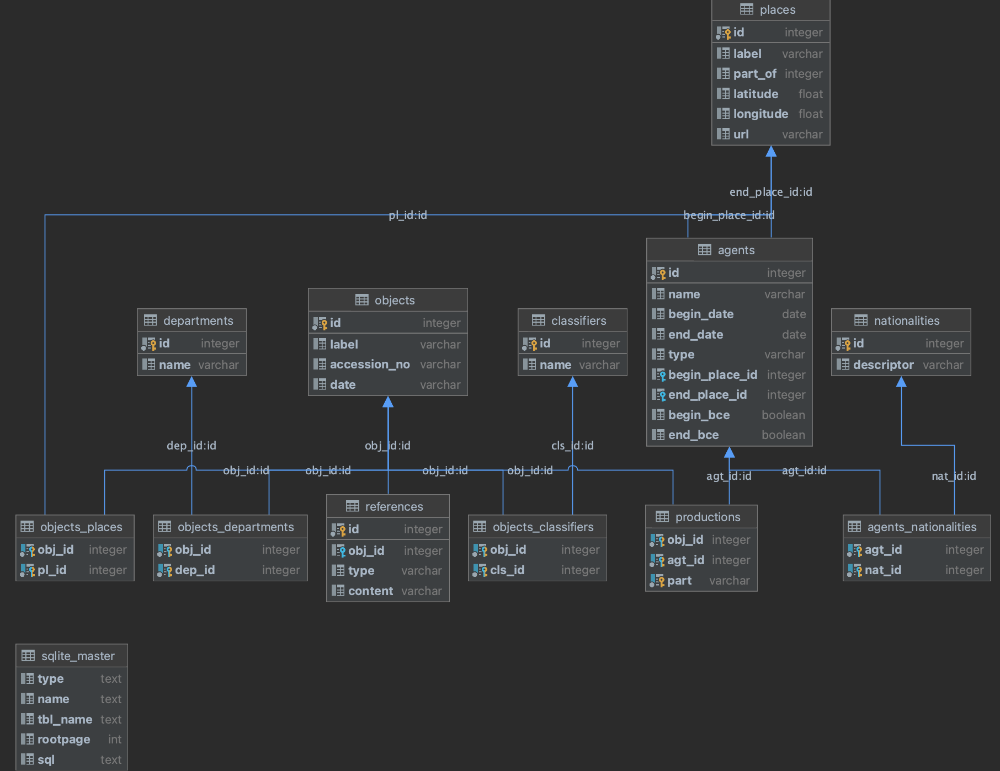

# CPSC 419: Command-line Application

## Due Friday Feb 9 11:59 PM NHT (New Haven Time)

## Table of Contents

- [CPSC 419: Command-line Application](#cpsc-419-command-line-application)
  - [Due Friday Feb 9 11:59 PM NHT (New Haven Time)](#due-friday-feb-9-1159-pm-nht-new-haven-time)
  - [Table of Contents](#table-of-contents)
  - [Purpose](#purpose)
  - [Rules](#rules)
  - [Getting Started](#getting-started)
  - [Your Task](#your-task)
  - [The Database](#the-database)
    - [Database Schema](#database-schema)
    - [English Description](#english-description)
  - [The `lux.py` Program](#the-luxpy-program)
  - [The `luxdetails.py` Program](#the-luxdetailspy-program)
  - [Source Code Guide](#source-code-guide)
  - [Input Specification](#input-specification)
  - [Error Handling](#error-handling)
  - [Testing](#testing)
    - [Boundary Testing](#boundary-testing)
    - [Statement Testing](#statement-testing)
    - [Test Automation](#test-automation)
    - [Unit Testing](#unit-testing)
  - [Program Style](#program-style)
  - [Advice](#advice)
  - [Submission](#submission)
  - [**_Submit your assignment solution to Canvas as a link to that release._**](#submit-your-assignment-solution-to-canvas-as-a-link-to-that-release)
    - [Late Submissions](#late-submissions)
    - [Grading](#grading)


## Purpose

The purpose of this assignment is to help you learn or review database programming in Python.
If done properly, the assignment also will give you practice at composing modular code.

## Rules

You must work on this assignment as a group of two students.
If you have not found or been assigned a partner by the time you read this, please let an instructor know.

It must be the case that either you submit all of your team's files or your teammate submits all of your team's files.
(It must not be the case that you submit some of your team's files and your teammate submits some of your team's files.)
Your `README` file and your source code files must contain your name and your teammate's name.
See below in the [Submission](#submission) section for details on what and how to submit.

## Getting Started

> **Note**: this section contains exactly the text on the Canvas assignment, reproduced here only for completeness of this document.
> Since you made it here, you can safely ignore this section.

To get started, you must follow the steps below to successfully set up you group and download the template files.

1. Register your biweekly pset group on Canvas.
    * You can do this by going to People -> Groups and joining a group named "Biweekly Assignment Group #" ([guide](https://guides.instructure.com/m/4212/l/64913-how-do-i-join-a-group-as-a-student)).
        * Make sure that both you and your partner are in the same group!
        * **Even if you work alone, sign up to a group.**
    * This step links your group to the canvas assignment.
    * Once this step is finished, only one of you will submit the assignment!

2. Accept [this GitHub classroom assignment](https://classroom.github.com/a/GzwezjsU).
    * GitHub classroom will yet again ask you to create a team, whether you will be working in pairs or individually.
        * **Name this team identically to your Canvas group**, *e.g.* "Biweekly Assignment Group 13".
    * Let your other team member join your team.
    * This step creates a GitHub repository for your team and links your team members' GitHub ids.
        * If you do not have a GitHub account, you are required to create one for this course
    * Use this git repository to track your assignment development.
    * If you have never used Git or GitHub before, or if you'd simply like some additional experience, complete the [Git/GitHub Primer](https://classroom.github.com/a/KnMlxgKP). There is no due date and it is not graded. 

3. Download the [`lux.sqlite`](https://yale.instructure.com/files/8452647/download?download_frd=1) database file from Canvas and place it in your new repository folder.
    > **Important**: Do not track `lux.sqlite` in your git repository.
    > It is too large to be hosted on GitHub and recovering from an error telling you that is challenging at best.
    > The included `.gitignore` file in the template repository will help with this, so *do not change or remove* that file.
    > You may keep the database file in the repository folder, but you must be careful not to *track* it.

    * One possible alternative to keeping the databse file directly in your repository is to keep it in a different folder and store only a [link](https://man7.org/linux/man-pages/man1/ln.1.html) to the "real" database file. Doing so would eliminate the need to copy the very-large file for each of your assignments.

## Your Task

Any museum must maintain data about objects and artwork they have in their collection.
Those data typically are kept in a database.
The museum's curator must provide an interface that allows visitors and other interested parties to query the database.

Assume that you are working for the Yale University Art Gallery (YUAG).
You are given a database containing data about objects and artwork stored in the gallery's collection.
Your task is to compose Python programs that allow museum visitors and other interested parties to query the database.

For this assignment your programs must have simple textual interfaces.
The next assignments will ask you to enhance your programs in a few ways, perhaps most notably such that they have graphical user interfaces.
So it will be to your advantage to modularize your code so you easily can replace the textual interfaces with a graphical one.

## The Database

The database is a SQLite database that is stored in a file named `lux.sqlite`.

### Database Schema

That file is provided as an attachment to this assignment, and its schema is in the image below (also available as an attachment to this assignment in the file `images/lux_database.png`).



The database consists of these tables and fields:

* `objects`
    * `id` (primary key)
    * `label`
    * `accession_no`
    * `date`

* `agents`
    * `id` (primary key)
    * `name`
    * `begin_date`
    * `begin_date_is_bce`
    * `end_date`
    * `end_date_is_bce`
    * `begin_place_id` (foreign key, references `places.id`)
    * `end_place_id` (foreign key, references `places.id`)

* `departments`
    * `id` (primary key)
    * `name`

* `classifiers`
    * `id` (primary key)
    * `name`

* `places`
    * `id` (primary key)
    * `label`
    * `part_of`
    * `longitude`
    * `latitude`
    * `url`

* `references`
    * `id` (primary_key)
    * `obj_id` (foreign key, references `objects.id`)
    * `type`
    * `content`

* `nationalities`
    * `id` (primary key)
    * `descriptor`

* `productions`
    * `obj_id` (foreign key, references `objects.id`)
    * `agt_id` (foreign key, references `agents.id`)
    * `part`

* `objects_classifiers`
    * `obj_id` (foreign key, references `objects.id`)
    * `cls_id` (foreign key, references `classifiers.id`)

* `objects_departments`
    * `obj_id` (foreign key, references `objects.id`)
    * `dep_id` (foreign key, references `departments.id`)

* `objects_places`
    * `obj_id` (foreign key, references `objects.id`)
    * `pl_id` (foreign key, references `places.id`)

* `agents_nationalities`
    * `agt_id` (foreign key, references `agents.id`)
    * `nat_id` (foreign key, references `nationalities.id`)

### English Description

In plain English, the database is organized as follows.

Every object (painting, sculpture, drawing, book, *etc.*) in the YUAG collection has a corresponding row in the `objects` table.
An object has a label (*i.e.*, its title), an accession number (a code describing when it was acquired) and the date on which it was created.

An object was created by zero or more agents, each of which has a corresponding row in the `agents` table.
Objects and their creating agents are linked by the `productions` table, which describes what part of an object was created by the agent.
(For example, the YUAG collection contains an Apple iBook G3, which has a *manufacturer* called "Apple Computer, Inc." and a *designer* called "Jonathon Ive".)

An object is classified in several ways, each of which corresponds to a row in the `objects_classifiers` table.
Classifiers include "painting", "sculpture", "portrait", *etc.*, and every classifiers for any object has a corresponding row in the `classifiers` table.

An object is "referred to" in several ways.
Each of the ways an object is referred to has a corresponding row in the `references` table.
References include how the gallery acquired the object, a long description of the object, or, in some cases, the URL of an image of the object.

An object belongs to one or more `departments`, and each department (obviously) holds many objects.
YUAG departments and their held objects are linked by the `objects_departments` table.

An object is associated with potentially several `places`.
Each place an object is associated with has a corresponding row in the `objects_places` table.

Each agent in the `agents` table is associated, via the `productions` table, with zero or more objects.
Some agents are individuals; others are companies, collectives, or other organizations.
An agent's `type` is one of "person" or "group".
An agent has a `name`, which is either the person's name or the operating name of the group.
The two dates in the agents table, `begin_date` and `end_date` have slightly different meanings depending on the type of agent they describe.
If the agent is a person, the dates are that person's birth date and death date, respectively.
If the agent is a group, the dates are that groups founding date and dissolution date, respectively.
The columns `begin_date_is_bce` and `end_date_is_bce` are boolean flags to indicate that the date refers to a time before year one.
Be careful performing calculations on dates having the associated BCE flag set.
A similar approach is taken for the `begin_place_id` and `end_place_id` columns: they describe either the places in which a person was born and died or the places in which a group was formed and dissolved.

An agent has zero or more `nationalities`, which can be accessed via the `agents_nationalities` table.
A nationality has a `descriptor` which is the English word one would use to describe a person of a nationality, such as "American" or "Ugandan".

Each `place` in the world (at least, those places associated with an object or agent in the YUAG collection) has a corresponding row in the `places` table.
A place's `label` is the English name used to refer to that place
A place is typically a town, city, state, or country, but the kind of a place is not identified directly in the database.
Instead, the `places` table contains a column `part_of` that refers to a *different* place's `id` (an invariant on the table is that there should be no cycles&mdash;but this is not enforced by the DBMS!).
The `longitude` and `latitude` columns are the coordinates on Earth of the identified place.
Column `url` refers to a file (a JSON file) containing additional information about the place.

**Your first step must be to familiarize yourself with the database.**
There are hundreds of thousands of rows in the database.
It might benefit you to vist the gallery in person to get a sense of the scale, depth, and kinds of things you'll find in the database, and to give yourself ideas for test inputs.
The SQL/Lux Bootcamp assignment will also serve to lay a foundation for your understanding of the database.

## The `lux.py` Program

You must compose two programs, the first of which must be named `lux.py`.
This program will display in the console a table of objects filtered by department, agent, classification, and title.

Here are the requirements for the behavior of your `lux.py` program.

When executed via a command such as `python lux.py -h`, your program must display the following help message:

```
usage: lux.py [-h] [-d date] [-a agt] [-c cls] [-l label]

                options:
                -h, --help show this help message and exit
                -d date show only those objects whose date contains date
                -a agt show only those objects produced by an agent with name containing agt
                -c cls show only those objects classified with a classifier having a name containing cls
                -l label show only those objects whose label contains label
```

> **Hint**: Design your `lux.py` such that it uses the standard Python `argparse` module with the `allow_abbrev=False` option.
> The required help message is the default behavior of that module.
> The help message may differ slightly based on your platform or version; do not worry about that&mdash;we are looking for the default behavior of `argparse`.

The output of your program must be contain the following information about each object satisfying the search criteria:

1. The object's `id`
2. The object's `label`
4. The object's `date`
3. A list containing the `name` of each agent associated with the object, and the `part` each agent produced in the format `"{name} ({part})"`, sorted in ascending alphabetical order of the agent's name then in ascending order of the part
    * The agent/part pairs must appear in a comma-separated list
5. A list containing the `name` of each classifier for the object, sorted in ascending alphabetical order
    * Each classifier must be on its own line

The first line of output must indicate the number of objects shown, such as `"Search produced {count} objects."`.
Below that, the output must have the appearance of a table, similar to the view produced by the `sqlite3` command-line tool when a query is executed.
The specifics of the formatting are up to you, but there are a few guidelines it must follow.

* Each column must have a header row, with the following headers:
    1. "ID"
    2. "Label"
    4. "Date"
    3. "Produced By"
    5. "Classified As"
* The header row must be visually separated by at least one line from the rest of the table
* Columns of the table must be visually separated by at least 1 character
* No line of output may be more than 100 characters long, or the width of the terminal (whichever is smaller)
    > **Hint**: use the `shutil.get_terminal_size()` function to query the size of the terminal
* The primary sort of the table must be in ascending order of object `label`s and the secondary sort must be in ascending alphabetical order of object `date`s
* The program output should never exceed 1000 objects
* The output of the program, when run with no arguments, must include the first 1000 objects in the database according to the sorting orders specified above

> **Note**: Precisely formatting textual output as a table is tedious and in this particular case requires some pretty intricate code.
> Since the goal of this assignment is to teach you how to interact with a database and not how to write sneaky formatting code, we have provided for your use a module named `table.py` that you may use to format your table output.
> You do not have to do so, and you may find it easier to "roll your own" or to leverage a third-party package from the Python community.
> (As a reminder, if you use a package that is not part of the Python Standard Library, you must cite it.)
<hr />

> **Note**: Each *row* of the displayed table might span multiple *lines* of output if, for example, the object's label is very long or if there are many agents associated with the object.
> The provided `table.py` uses the `textwrap` module from the Python standard library to handle this, and it is recommended that you also do so if you choose not to use `table.py`.
> If there is a row of the table that spans multiple lines of output, every line break in that row must occur at a word boundary, and never in the middle of a word, unless the width is so restricted as to render this impossible.

The program must accept any combination of the `-d`, `-a`, `-c`, and `-l` arguments (each appearing at most one time).
Their meaning is as follows:
* `-d date` filters objects to those with date field containing `date`
* `-a agt` filters objects to those produced by an agent with name containing `agt`
* `-c cls` filters objects to those classified by a name containing `cls`
* `-l label` filters objects to those whose label contains `label`

If there are multiple arguments supplied, `lux.py` must combine the filters using `AND`; that is, for example, if the `-a` and `-l` arguments are both supplied, the output should display objects that match both filter criteria.

Filters must be case-insensitive, that is, the argument `-l ibook` must match an object with a label such as "iBook G3".

Filters must include leading and trailing whitespace, that is, the argument `-l 'er '` must match "Flower Garden" but not "Western Motel".

> **Note**: Separate words on the command line are interpreted as separate command-line arguments, *not* single multi-word arguments unless they are surrounded by quotes.
The argument list `-a van gogh -c painting` is invalid and your program does not need to handle it.
On the other hand, the argument list `-a 'van gogh' -c painting` *is* valid and your program must filter objects having agent names that contain "van gogh" and a classifier containing "painting".

## The `luxdetails.py` Program

Your second program must be named `luxdetails.py`.
This program will take as input the `id` of an object and print details about it, including the object label, accession number, date, place, agents, departments, classifications, and references.
If the `id` is not that of an object in the database, your program must display a meaningful message and exit.

Here are the requirements for the behavior of your `luxdetails.py` program.

When executed via a command such as `python luxdetails.py -h`, your `luxdetails.py` must display the following help message:
```
usage: luxdetails.py [-h] id

positional arguments:
  id         the id of the object whose details should be shown

options:
  -h, --help  show this help message and exit
```

> **Hint**: Design your `luxdetails.py` such that it uses the standard Python `argparse` module.

The output of your `luxdetails.py` program must be divided into several sections, each separated from the previous one by a single blank line.
The header for a section must be on its own line
Those sections are:
* A section with header "Summary", containing a single-row table with the following column headers and content:
    * "Accession No.", containing the accession number of the object
    * "Date", containing the object's date
    * "Place", containing the object's place
    * "Department", containing the object's department
* A section with header "Label" containing the object's label
* A section with header "Produced By", containing a table with details of all agents that produced this object.
    The table must have the following column headers and content:
    * "Part", containing the part(s) of the production carried out by each agent
    * "Name", containing the name of each agent
    * "Nationalities", containing all nationalities of each agent, each on its own line
    * "Timespan", containing the *year* of each agent's `begin_date` and the *year* of each agent's `end_date`, separated by a hyphen
        * Some agents are still alive/active; in those cases the Timespan column must contain text such as "1967-"
    * This list must be sorted in ascending alphabetical order of agent name, then part, and finally by nationality
* A section with header "Classified As", containing a list of all classifiers for the object, with one per line
  * This list must be sorted in ascending alphabetical order of the classifier name
* A section with header "Information", containing a table of all `references` to the object, with two columns: "Type" and "Content" (with the obvious values)

> **Note**: Some reference contents contain HTML-like content.
> It must be displayed verbatim in your output.
<hr />

> **Note**: As with your output from `lux.py`, the width of the output of `luxdetails.py` must not exceed the smaller of 100 characters or the width of the terminal.

## Source Code Guide

Here are the *requirements* for the source code of your solution.
* The program must communicate with a SQLite database in a file named `lux.sqlite`, organized as described above.
* The program must use SQL prepared statements for every database query.
    (This protects the database against SQL injection attacks.)
* Every invocation of the program must use exactly one `cursor` object
    * Note that this implies that it must also use exactly one database `connection` object!

In addition to the functional requirements for your source code, there are additional stylistic requirements on which your program will be partially graded.

* Modularize your code extensively so that your "main" function looks something like this:
```python
def main():
    filters = get_filter_terms()
    objects = get_filtered_objects(filters)
    output_objects(objects)
```
* Encapsulate database code and print statements inside modules that can be replaced if you decide to display courses in a different fashion or retrieve the data from a different source.

## Input Specification

You may assume the users of your `lux.py` and `luxdetails.py` programs are acting generally "in good faith". In particular, you may assume...

* The user will only ever provide arguments at the command line that conform to the allowed arguments:
    * The only provided arguments will be `-h`, `-d date`, `-a agt`, `-c cls`, and `-l label` for `lux.py`
    * The only provided argument will be a single positional argument or the `-h` flag for `luxdetails.py`
* The database exists in a file named `lux.sqlite` and is well-formed according to the database specification above

However, you may *not* assume...

* That there are any objects at all in the database
* That the single argument to `luxdetails.py` is a numeric argument
* That the single argument to `luxdetails.py`, even if it is numeric, corresponds to an object in the database

## Error Handling

Despite the assumptions you may make about input, your `lux.py` and `luxdetails.py` should be reasonably robust.
Since we haven't discussed error handling in this course, whatever previous experience you have handling errors will be sufficient for this assignment.
Keep in mind that as we progress through the course, error handling will become more important (and the specification of program input more relaxed!).

The following recommendations are provided only for your benefit of cases to consider as potentially program-breaking.
We will not test your program on such inputs, but we encourage you to design your solution to handle them nonetheless.

Your `lux.py` could handle erroneous command-line arguments "gracefully". These commands illustrate:
```
$ python lux.py c qr
$ python lux.py "-c " qr
$ python lux.py -a qr st
$ python lux.py -c
$ python lux.py -d qr -l
$ python lux.py -l -c paint
$ python lux.py -x
```

Your `luxdetails.py` could handle erroneous command-line arguments "gracefully". These commands illustrate:
```
$ python luxdetails.py
$ python luxdetails.py 12488 10034
$ python luxdetails.py abc123
$ python luxdetails.py 57183947298
```

Your `lux.py` and `luxdetails.py` could handle "database cannot be opened" errors.
If the database cannot be opened, then your programs could write a descriptive error message&mdash;the one contained within the thrown Exception object&mdash;to its `stderr`.

Your `lux.py` and `luxdetails.py` also could handle "corrupted database" errors.
In the context of this course, a corrupted database is one that causes the database driver, upon interaction with the database, to throw an exception.
In the case of SQLite, a corrupted database might consist of an invalid SQLite file&mdash;for example, a file that's empty or contains simple text.
More generally, a corrupted database might be a database that is missing a table that the interaction requires, or is missing a column/field that the interaction requires.
If the database is corrupted such that the SQLite driver's execution of a `SELECT` statement throws an exception, then your program could write a descriptive error message&mdash;the one contained within the thrown Exception object&mdash;to its `stderr`.

> **Note**: Good question from a student during a recent semester:
>
> Suppose the user runs `luxdetails.py` for a particular `id`, the program queries the `productions` table to find the corresponding `agt_id`, and the program then queries the database to fetch the row in the `agents` table with that agent ID.
> Furthermore, suppose the database is corrupted such that no row with that agent ID exists in the courses table.
> Should our `luxdetails.py` handle that particular database corruption error?
>
> **Answer**: No. Generalizing...
>
> Database management systems can enforce *foreign key* integrity constraints on the databases that they manage.
> So any DBMS would not allow its databases to contain the kind of violation that the student described.
> And so client programs would not need to check for such violations.
>
> That is a very good thing.
> With a sufficiently rich database, it is very difficult for a client program systematically to check for foreign key integrity constraint violations.
> And it would be absurdly redundant for every client program to check for such violations.
>
> All of this is to say that it's more realistic to compose your `lux.py` and `luxdetails.py` such that they don't check for foreign key integrity constraint violations.
> And so it's fine to compose your programs such that they check for only the kinds of database-related errors that are described in this specification: file-level errors and schema-level errors.
> The first easily could happen if the `lux.sqlite` file is missing from the working directory.
> The second could happen if, for example, the `lux.sqlite` file is present but empty.

## Testing

We'll take a (slightly) more systematic approach to software testing techniques in lectures later in the semester.
In the meantime, to test your programs it will be sufficient to rely upon (1) your knowledge of testing from your previous experience, and (2) this [A Software Testing Taxonomy](docs/TestingTaxonomy.pdf) document, courtesy of Princeton University.

Test your `lux.py` and `luxdetails.py` programs by (1) reviewing this assignment specification thoroughly, making sure that your programs conform to every aspect of it, and (2) comparing the behavior of your program with the example outputs that will be released in the coming days.

### Boundary Testing

Focus on boundary (alias corner case) testing.
Of course, make sure that your programs handle normal data.
But also make sure that your programs handle unusual data: objects that have no references, lots of references, agents with several nationalities, and so forth.

### Statement Testing

Next, focus on statement (alias coverage) testing.
Your tests should cause every statement of your `lux.py` and `luxdetails.py` to be executed.

You're encouraged, but not required, to use the Python `coverage` tool to generate a coverage report showing which lines of your programs have and have not been executed by your tests. These are the steps:
1. Repeatedly issue commands of the form p`ython -m coverage run -p lux.py arguments`.
    Each of those commands runs your `lux.py` with the specified arguments, and generates a coverage report in a file named `.coverageX` (for some `X`).
    The report indicates which lines of your `lux.py` were executed and which were not.
1. Repeatedly issue commands of the form `python -m coverage run -p luxdetails.py argument`.
    Each of those commands runs your `luxdetails.py` with the specified argument, and generates a coverage report in a file named `.coverageX` (for some `X`).
    The report indicates which lines of your `luxdetails.py` were executed and which were not.
1. Issue the command `python -m coverage combine` to combine the coverage reports generated by steps 1 and 2 into one large coverage report in a file named `.coverage`.
1. Issue the command `python -m coverage html` to use the .coverage file to generate a human-readable report as a set of HTML documents in a directory named `htmlcov`.
1. Browse to `htmlcov/index.html` to check the report.
1. The files in your `htmlcov` directory should show that 100% of your programs' lines were executed.
    If the report doesn't show 100% coverage, then we recommend that you revise your testing plan accordingly, delete the `.coverage` file and the `htmlcov` directory, and repeat steps 1 through 5.

### Test Automation

You are encouraged, but not required, to automate your testing.
Automating your testing could reduce the amount of typing that you must do, and also could increase the quality of your programs.
It's also likely to save you time in future assignments to have some automated test scaffolding built early on.

To automate your testing of `lux.py` you might compose a program named, say, `testlux.py`.

At the core of the `testlux.py` program might be function calls of the form `os.system('somecommand')`.
Each such function call would execute `somecommand`, just as if `somecommand` were entered as a command at a shell prompt.
For example, the function call `os.system('python lux.py -l western')` would execute the command `python lux.py -l western`.

You might design your `testlux.py` program to execute `lux.py` multiple times with various command-line arguments.
You then might:

Run `testlux.py` using your `lux.py` and capture the output in a file (`python testlux.py > out1 2>&1`).
Manually inspect the database to determine what the correct output *should* be, and type that in a file called, *e.g.*, `outc`.
Compare the two output files via a `diff` command (`diff -y out1 out2`).
The contents of the two output files should be the same, except for the name of the program within error messages.
You might automate your testing of `luxdetails.py` in a similar way.

Incidentally, if you're clever you could use your `testlux.py` and `testluxdetails.py` programs to generate your coverage report.

### Unit Testing

The kind of testing described above, in which the entire program is repeatedly run and the output compared to correct output, is called *system testing*.
You probably will notice that generating correct output files against which to compare your program's output is quite challenging and error-prone.
A more scalable method of testing is called *unit testing*.

In unit testing, rather than testing the behavior of the project as a whole, each "unit" (*e.g.* function) is tested in isolation.
By doing so, correctness can be assessed with much finer granularity than simply running the whole program.
The beauty of unit testing is that if every individual function is correct, then the entire program is correct (because if you followed Python convention, the entire program is enclosed in an single function, `main()`)!

The challenge of unit testing is: how do you know what a particular function should do, and how do you check that it's right?
The answer is to write many small functions with well-defined semantics.
This method of designing software has the consequence that if you intend to unit test, your functions should be designed such that you can check their execution for correct behavior.
This is an additional level of design for software beyond the purely operational, so we encourage you to think about this and set aside some additional design time for your psets to enable unit tests.

Unit testing will be covered briefly later in the semester; for now, it is sufficient to read a blog post or two and study briefly the documentation for the Python `unittest` module.

## Program Style

Your programs must be well styled.
Generally, by consensus of the Python community, good Python style is defined by the [PEP 8 -- Style Guide for Python Code](https://www.python.org/dev/peps/pep-0008/) website.

The Python community has developed a static code analysis tool named `pylint`, installable via `$ pip install pylint`.
The pylint tool (configured with a `.pylintrc` file) generates a report critiquing the style of given Python code.
The pylint tool enforces many of the PEP 8 guidelines, and some additional guidelines too.
Although the lecture example programs and the scaffolding programs mostly cause pylint to generate perfect reports, they sometimes do not.
Your assignment programs, however, must generate a good report (you may leave a few intentional or unavoidable exceptions&mdash;a score $>9.00$ is fine and the report should be free of easy-to-fix issues such as "trailing whitespace").
Part of your grade on this assignment is the score from pylint when run in the default configuration with all of your submitted files&mdash;including the scaffolding file(s)!&mdash;rounded *up* to the nearest integer.

Using pylint is easy.
You can critique one file comprising your programs at a time:
```
python -m pylint lux.py
python -m pylint luxdetails.py
...
```

However, a better approach is to critique all files comprising your programs at the same time:
```
python -m pylint lux.py luxdetails.py ...
```
When given multiple files, pylint performs some cross-file critiquing.
So the "all files at the same time" approach may generate warnings in addition to those generated by the "one file at a time" approach.
Make sure you use the "all files at the same time" approach, as your grader will.

## Advice

The command-line format of `lux.py` is incomplete in the logical sense.
Most notably the format doesn't allow the user to express `OR` relationships in queries.
For example, the format doesn't allow the user to express queries of the form "Display data for all objects whose classification is 'sculpture' OR 'painting'" or "Display all objects that were produced by 'van Gogh' OR 'hals'."
Don't be concerned about that.
Remember that the purpose of the assignment is not to develop a great art collection search application *per se*.
Instead its purpose is to give you experience with database programming&mdash;experience that, we hope, will help you when developing your project, and beyond.

Modularize your code as much as you can.
In particular, isolate the user-interface-related code and the database-related code in distinct modules.
Good modularity will help you to reuse your code from this assignment in the next assignment.

Make sure that the output of your `lux.py` conforms to the specified format.
If it doesn't, then your program will create more work for our graders, putting them in a bad mood.
The same goes for your `luxdetails.py`.

## Submission

Rename this file `TEMPLATE_README.md` and replace it with a new `README.md` file.
Your new `README` file must contain:

* Your name and netid and your teammate's name and netid, at the beginning of the file
* A paragraph describing your contribution, and another paragraph describing your teammate's contribution
    * Please be thorough; we are looking for two substantial paragraphs, not a sentence or two
* A description of whatever help (if any) you received from other people while doing the assignment
* A description of the sources of information that you used while doing the assignment, that are not direct help from other people
* An indication of how much time you spent doing the assignment, rounded to the nearest hour
* Your assessment of the assignment:
    * Did it help you to learn?
    * What did it help you to learn?
    * Do you have any suggestions for improvement? *Etc.*
* (Optionally) Any information that will help us to grade your work in the most favorable light
    * In particular, describe all known bugs and explain why any pylint style warnings you received are unavoidable or why you know better than pylint (a convincing argument may negate some pylint style penalties you accrue)

Your README file must be a plain text file: don't create it using Microsoft Word or any other word processor, although you are encouraged to format it using [markdown](https://www.markdownguide.org/) tags.

Package your assignment files by [creating a release](https://docs.github.com/en/repositories/releasing-projects-on-github/managing-releases-in-a-repository#creating-a-release) on GitHub in your assignment repository.
There must be at least the following files with the following (exact) names in that repository when you submit it:

* `README.md`
* `lux.py`
* `luxdetails.py`

Ensure that any additional files needed by your program (such as other Python modules) are in the repository snapshot captured by the release.

> **Note**: If you have installed external packages, you must also include a file named `requirements.txt` containing the dependencies of your project.
> It can be created from your virtual environment by running the following command:
> ```
> $ pip freeze -r requirements.txt
> ```
> 
> Failure to include a `requirements.txt` file if you use third-party packages will result in an automatic 5% penalty and a request that you submit an appropriate `requirements.txt` file to the graders.
<hr/>

## **_Submit your assignment solution to Canvas as a [link to that release](https://docs.github.com/en/repositories/releasing-projects-on-github/linking-to-releases)._**

As noted above in the [Rules](#rules) section, it must be the case that either you submit all of your team's files or your teammate submits all of your team's files.
(It must not be the case that you submit some of your team's files and your teammate submits some of your team's files.)
You and your partner may submit multiple times; we will grade the latest files that you submit before the deadline *unless a particular version is requested as the canonical version*.

Please follow the rules on what to submit and how.
It will be a big help to us if you get the filenames right and submit exactly what's asked for.
Thanks.

### Late Submissions

The deadline for this assignment is **11:59 PM NHT (New Haven Time) on Feb 9, 2023**.
There is a strict 15 minute grace period beyond the deadline, to be used in case of technical or administrative difficulties, and not for putting final touches on your solution.
(If you can do it in as little as 15 minutes, it probably is insignificant enough not to change your grade.)

Late submissions will receive a 5% deduction for every 12-hour period (or part thereof) after the deadline.
After 72 hours, the Canvas assignment will close and submissions after that time will not receive any credit.

Except for submissions after the 72-hour deadline (*which are not accepted*), the timestamp on the commit associated with the linked release will determine what late penalties, if any, are applied.

### Grading

Your grade will be based upon:

* Correctness, that is, how closely your programs conform to the specifications in this document, from 0-12 (0-6 for each of `lux.py` and `luxdetails.py`).
* Style, that is, the quality of your program style. This includes not only style as manually assessed by the graders (including modularity, cleanliness, and pythonicity) but also style as reported by the pylint tool. Style is graded from 0-10 for pylint and 0-6 for manual style assessment
* Performance. We do not enforce specific time bounds for queries. At this stage of the semester, we do not expect you to have optimized your queries&mdash;that will come later. You are however required to adhere to the [source code requirements](#source-code-guide) above, including always using prepared statements and using a single database cursor/connection. Performance is graded from 0-2 (0-1 for each of prepared statements and single cursor).

Your score in each category will be an **integer**&mdash;that is, you will not receive, for example, 5.25/6 for the correctness of your program.
The 0-6 grading scale for correctness and style has the following meaning:
* 6: The submission is excellent and exceeds expectations
* 5: The submission satisfies all or nearly all requirements
* 4: The submission satisfies a majority, but not nearly all, of the requirements
* 3: The submission satisfies about half of the assignments or slightly fewer
* 2-1: The submission satisfies hardly any of the requirements
* 0: The submission is unacceptable

> **Note**: The scale puts "satisfies all requirements" at 5/6.
> **You will not earn 100% on psets unless your work is exemplary.**
> You do not need to earn 100% on psets to earn an A in this course.

These three category scores will then be weighted as follows:
* Correctness: 60%
* Style: 20%
  * 10% pylint
  * 10% manual assessment
* Performance: 10%

If your code fails the tests on some particular functionality, your grader will inspect your code manually to try to assign partial credit for that functionality.
Partial credit will be given only if there is an *obvious* "quick fix" (*e.g.*, you have accidentally changed the name of the database file and your solution points to a file with a name that does not match the grader's copy of the database); if no such quick fix exists then no partial credit for that feature will be given.

<hr/>

Adapted from Assignment 1 for COS 333 &copy; 2021 by Robert M. Dondero, Jr., Princeton University

This version &copy; 2024 by Alan Weide, Yale University
